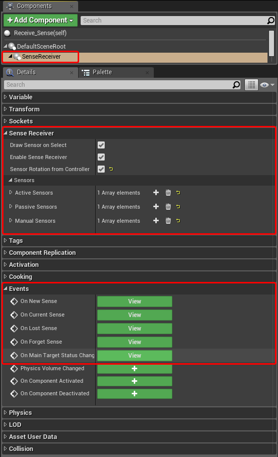
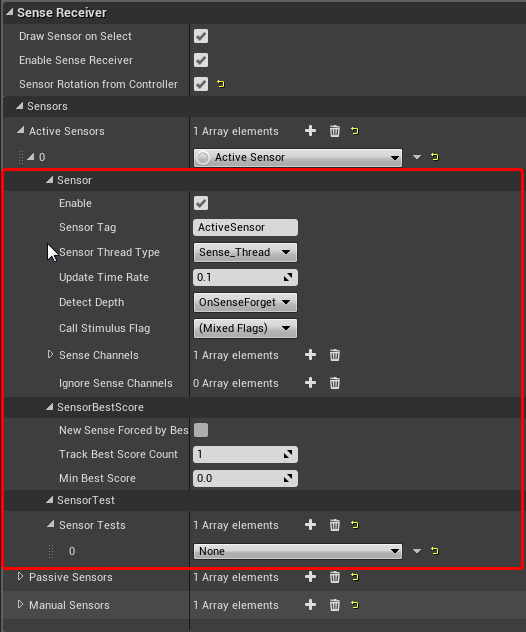

********

# UE4 SenseSystem

1. [SenseSystem overview](#1-sensesystem-overview)
    - 1.1 [Features](#11-features)
2. [Supported platforms](#2-supported-platforms)
3. [SenseSystem Architecture](#3-sensesystem-architecture)
    - 3.1. [Architecture](#31-architecture)
    - 3.2. [Blueprint API](#32-blueprint-api)
    - 3.3. [SenseReceiverComponent](#33-sensereceivercomponent)
    - 3.4. [Sensor](#34-sensor)
    - 3.5. [SensorThreadType](#35-sensorthreadtype)
    - 3.6. [SensorTest](#36-sensortest)
    - 3.7. [SensedStimulus](#37-sensedstimulus)
    - 3.8. [SenseStimulusComponent](#38-sensestimuluscomponent)
    - 3.9. [SenseStimulusInterface](#39-sensestimulusinterface)
    - 3.10. [SenseObstacleInterface](#310-senseobstacleinterface)
    - 3.11. [How It Works ?](#311-how-it-works)
    - 3.12. [Nativization](#312-nativization)
4. [Known Issues](#4-known-issues)
    - 4.1. [ThreadSafe](#41-threadsafe)
6. [Report a Bug and Feedback](#6-report-a-bug-and-feedback)
7. [Update History](#7-update-history)
    - 7.1 [v1.04](#71-v104)
    - 7.2 [v1.10](#72-v110)
    - 7.3 [v1.20](#73-v120)
    - 7.4 [v1.24](#74-v124)

********

## 1. SenseSystem Overview

**SenseSystem** is a flexible, extensible, and multi-functionalsystem for detecting and responding to
the detection of game objects in UnrealEngine. The ease of implementation and fine-tuning makes it
suitable for projects of the most diverse genres from shooters, strategies, and to arcade ones. Allow the
player or AI to interact with the entire game world.

Its purpose is an alternative to existing systems in the engine such as AIPerception, PawnSensing,
EQS. **SenseSystem** has better performance, a widerrange of tasks, more features, more simple and
universal to use.

### 1.1 Features:

* Has all the capabilities of AIPerception, PawnSensing and some EQS features, systems that detect
targets at the current time. There are all standard sets of sensors such as vision, touch, noise,
distance.
*! The physical engine is not used to detect overlappingdetection zones.
* Performance SenseSystem shows a significant increasein performance compared to standard
tools, especially when increasing system participants.
* Built-in detection assessment similar to EQS, and the ability to evaluate through translucent
objects, with customization.
* The separation of detection channels has been expanded, allowing you to separate the work of
various sensors (making it a bit like the work of a physical engine).
* The system components have no dependencies on the owner classes, any actor can be the owner
of a detector component or an irritant component.
* Ease of implementation: add components, set up intuitive settings, define delegates - the system is
ready to work! Extensive Blueprint-API allows you to implement the system in the most convenient
way.
*! Multithreading. for complex and performance-sensitivedetection checks, there are options for
removing them from the game stream.
* The system has a built-in reaction function for detecting both the detector and the target, which is
implemented through delegates, which allows you to implement the behavior-reaction of the
detector owner and the target upon detection.
* Can remember goals, forget goals, distinguish new goals from old ones, for each goal individually.
* The scope is not limited only to AI-Sensing, the system is also easily integrated into any system of
interaction between an arbitrary actor and the environment, interaction with objects without direct
aiming, selection of objects with a cursor, interaction with groups of objects.
* The ability to customize the system both in Blueprints and in C ++
* There is a definition of the FOV camera’s field of view, which gives a lot of possibilities arising from
determining whether an object is in the field of view + the possibility of reaction to this. (for
example, logic logging) the
* The number of targets for detection can be very large - thousands of simultaneously detected
targets, tens of thousands. (Depends on the complexity of the tests, at the moment the most
expensive test is ray tracing to detect direct visibility which can be taken out in a separate stream)
* A sufficient number of options to adjust performance.
* There is a project with full examples of using the system.
* The complexity of the system: the architecture at first glance may not seem complicated, but the
own implementation of a similar system is rather cumbersome and time-consuming, it is difficult to
foresee all the features, dependencies, behavior with acceptable performance and versatility. Just
save time! Everything is ready, just buy it. ;)

********

## 2 Supported platforms

```
* The plugin was developed and tested on Win.
* Current supported platforms: Win64, Win32, Mac, Linux,PS4, XboxOne.
```

********

## 3 SenseSystem Architecture
### 3.1 Architecture

#### There are three main classes of the system:

* **SenseManager** - an object that stores information aboutthe components participating in the
system, allowing them to communicate with each other. For the functioning of the system you need one
created instance.
○ in UE4.22and later, implemented as **GameInstanceSubSystem** ,no further action is required.
○ Until UE4.22,
■ UObject,
■ this object is created together with **GameInstance** in a single copy
(EpicGames creates its “manager classes” in UE4 directly when creating the world, such as
UNavigationSystem, UAIPerceptionSystem, and so on ...
currently there is no api add your manager classes in a similar way)
■ adding it to **GameInstance** is required manually andimplementation of the interface for the
getter is also required.

* **SenseReceiverComponent** - a receiver that detects orreceives signals from the
SenseStimulusComponent, implementation through the UE4 component system.
○is the successor to **USceneComponent**.
○world position - is the default detection location.
○the component is compatible with any Actor owner, the
○ **the purpose** is to maintain and configure sensor objects,and the owner of the component
interacts with them.

* **SenseStimulusComponent** - stimulus, transmitter, registersthe owner as detectable,
implementation through the UE4 component system.
○is the successor of **UActorComponent;**
○only channels are configured in it for detecting
○components compatible with any Actor owner

#### The two main interfaces of:

```
* SenseStimulusInterface is the interface for annoyance.
* SenseObstacleInterface is the interface for translucentobjects.
```
```
* //version lower UE4.
SenseManagerInterface - getter interface is used toproduce SenseManager object participants
System
```

### 3.2 Blueprint API

all blueprint api can be found in the "palette" of functions in the category SenseSystem


### 3.3 SenseReceiverComponent

#### 3.3.1 SenseReceiverComponent Settings



#### 3.3.2 SenseReceiverComponent Explanation

**SenseReceiverComponent**
* **bDrawSensorOnSelect** :enable / disable the renderingof sensors when selecting an object ( **only
in the editor** ).
* **EnableSenseReceiver** : enable / disable the component.
* **SensorRotationFromController** : take component orientationinformation from the owner
controller, if one exists with the owner.
The default behavior **GetSensorTransform** in the systemis:

- taking locations from the receiver component
- and rotation from the controller (if one exists with the owner)

**Sensors**
* **ActiveSensors** : an array of objects - active sensors.
* **PassiveSensors** : an array of objects - passive sensors.
* **ManualSensors** : an array of objects - sensors withmanual control.

**Events** (delegates, dispatchers)
(all delegates return a pointer to the sensor that is associated with the current update, as well as an array of
structures **SensedStimulus** that will be described below.)
* **OnNewSense** : returns new contacts.
* **OnCurrentSense** : returns current contacts.
* **OnLostSense** : returns just lost contacts.
* **OnForgetSense** : returns forgotten contacts.

```
*OnMainTargetStatusChanged : delegate tracking thegiven actor.
```
An important part of these settings is Sensors.
Sensors are a class of objects that are created together with the SenseReceiverComponent,
they resemble EQS, that is, they can contain a set of tests.

There are several ready-made sensors that already have specific test suites.
It is also possible to customize and create your own sensor classes and test classes.

There are three main categories of sensors active passive and manual:
* **active** - sensors that are updated automatically bytimer, scanning the environment.
* **passive** - sensors that wait for messages from stimuli.
* **manual** - these are active sensors that scan the environmentwhen a function is called.

### 3.4 Sensor

#### 3.4.1 Sensor Settings



#### 3.4.2 Sensor Explanation

All sensors have a common set of settings that are inherent in the base class of all sensors
**SensorBase:**
* **bEnable** : enable / disable the sensor
* **SensorTag** : sensor identifier, by default it has thesensor class name
* **SensorThreadType** : an option that where the calculationwill take place sensor
* **UpdateTimeRate** : update interval (for active sensor,and for updating contact memory time by
**MaxAge** )
*** DetectDepth** :
The option can facilitate the calculation, the ability to not count and not cause unnecessary. Since
each stage involves certain costs
○ **SenseCurrent** : detect only current contacts.
○ **SenseNewDetect** : detect current and new contacts.
○ **SenseLost** : detect current, new and lost contacts.
○ **SenseForget** : detect current, new, lost, and remembercontacts.
* **CallStimulusFlag** : The throttling option when notifyingSenseStimulusComponent is responsible
for communicating with the stimulus and eventstriggering
○ **CallOnCurrentSensed** : call if this is a new contact
○ **CallOnNewSensed** : call if this is the current contact
○ **CallOnLost** : call if the contact is lost
○ **CallOnForget** : call if the sensor forgot about thecontact ( **MaxAge** )
* **SenseChels** : 255 possible individual channels forscanning, by default it contains channel 0
* **IgnoreSenseChannels** : channels that the sensor willignore.
* **SensorTest** : an array of the test suite that performsin
**SenseBestScoreturn:**
* bNewSenseForcedByBestScore: this option enables the forced filter for scanning, which is taken
from the BestSense setting.
Contacts that do not meet the conditions of **TrackBestScoreCount** and **MinBestScore** will be
skipped.
* **TrackBestScoreCount** : Maximum Contacts For **LimitBestSense**
* **MinBestScore** : Minimum Contact Rating for **BestSense**

Array structures stimuli, are the results of the sensor update arrays are sorted for quick access on the hash
pointerI SenseStimulusComponent
* **NewSensed:** detected in the latest update and beforethat were not seen
* **CurrentSensed:** detected at the moment
* **LostAllSensed:** detecting lost but still remain in memory:
* **LostCurrentSensed** Just Lost
* **ForgetSensed** : Forgotten
* **BestSensedID_ByScore** : IndexS **CurrentSensed** sortedby points

### 3.5 SensorThreadType

#### 3.5.1 SensorThreadType Explanation

**SensorThreadType** option which answers where the sensorcalculation will take place.
The choice of type depends heavily on the number of irritants and how often updates are called.

**Main_Thread** - suitable for a small number of irritantsand rare single sensor updates, and when
there is a margin of time for calculation.
**Sense_Thread** - suitable for regular updates on timerswith a large or medium amount of irritants.
**Sense_Thread_HighPriority** - with a large number ofsensors, this group will be processed out of
turn.
Example: player sensors do not have to wait for AI sensors to update.
**Async_Taskinfrequent** - suitable for updates witha large number of irritants.
sometimes it will use a game stream, or a rendering stream.

The **SenseThread** works only when there is at leastone sensor that needs it.
And it pauses until the sensor completes the update request.

### 3.6 SensorTest

#### 3.6.1 SensorTest Sensor Settings


#### 3.6.2 SensorTest Sensor Explanation

classes have been prepared for common tasks with a set of optimal checks: **SensorSight** ,
**SensorHearing** , **SensorTouch.**
Test classes for custom sensors prepared.
Checks: **distances** , **angles** , **tracing** , intersection ofa location with **Viewing / Camera frustum.**
Prepared abstract classes for overriding / customizationin blueprints, and sensors and tests.

All tests are performed in the order in which they are located in the array.
Each test receives a structure in the input test function **SensedStimulus.**
and should return ENUM ()
**ESenseTestResult**
* **Sensed** - the detection was successful
* **NotLost** - detection outside the settings, but withinthe bounds do not lose theobject
* **Lost** - the test failed

and also add quality assessment to the structure - assign or modify points, you can either lower them or
increase them.

general settings for tests:

```
SensorTestBase - the base class of the test
```
```
* EnableTest : enable - disable the test
* SkipTest : skip the test
* MinScore : the minimum score for passing the test.
```
**SensorLocationTestBase** - an extended test class basedon receiving **SensePoints** and a location test of
this structure.

```
* TestBySingleLocation : this option that the test isperformed only on the first test locations from the
array, according to the idea, it is best to determine the location of the actor there, otherwise the
location of the actor will be skipped and tests will be conducted with the remaining points.
For easy understanding, the code snippet for obtaining the boundaries of the check:
```
```
FIntPoint GetBoundFotSensePoints (TArray <FSensedPoint> & SensedPoints) const
{
if (! BTestBySingleLocation && SensedPoints.Num ()>1)
{
SensedPoints [0] .PointTestResult = ESenseTestResult :: None;
return FIntPoint (1, SensedPoints.Num ());
}
return FIntPoint (0, 1);
}
// in one case, only a point with index 0 is checked
// in another, all points except index 0
// this is an important point for understanding and overriding GetSensePoints ()
```
A custom test suite should have an order that is built on the principle
of lightweight performance ( check the flag)
to complex (mathematical calculations, ray tracing, etc.) tests.

### 3.7 Structure The SensedStimulus

structure stores detection data.
! Also, the structure has its own constructor, this implies that it will not be created through the Blueprints, or
declared as a Blueprint variable, this will lead to incorrect initialization of the structure. But it is read-write in
Blueprints when customizing the system.

```
* StimulusComponent - Pointer to a SenseStimulusComponent.
* Score - points for finding the best result, assignedin tests.
* SensedPoints - location of the object in which thedetection occurred.
An array of detection point structures, by default always has a zero element as the location of the
actor
```
### SensedPoint structure.

```
* SensedPoint is a vector location of this point forverification.
* PointScore - individual points for a given point,the overall score will be averaged over the data
from all participating points
* PointTestResult - individual test result for thispoint
```

### 3.8 SenseStimulusComponent

```
* bEnable - turns on / off the component
* DefaultAge - the standard time during which the detectedcomponent will be remembered,
without using an interface.
* DefaultScore - standard number of points, withoutusing an interface.
* InterfaceOwnerBitFlags
○ ESS_ScoreInterface - use the interface SenseStimulusInterface to get starting points.
○ ESS_AgeInterface - use the interface SenseStimulusInterface to get detection memory
time.
○ ESS_SensePointsInterface - use the interface SenseStimulusInterface to obtain locations
for detecting
* ReceiveStimulusFlag - use the
○ DetectGlobalSenseState - the option of detecting theglobal state - from all participants
simultaneously.
○ ReceiveOnNewSensed - do I receive global state eventswhen it is detected for the first
time?
○ ReceiveOnCurrentSensed - do I receive global stateevents when all participants are
currently detecting a component?
○ ReceiveOnLost - - whether to accept events of a globalstate when all participants forgot
the lost component?
○ ReceiveOnForget - do I receive global state eventswhen all participants forgot this
component?
* StimulusSensorNameResponse -array
○ SensorTag - sensor tag to which the component responds
○ Channels - an array of channels to which the component
* OnSenseStateChangedresponds - a delegate of the globaldetection state of this component
among all sensors. Inra ot only with the active DetectGlobalSenseState option.
Example: a component can be detected by multiple sensors at the same time,
and this delegate shows the general status.
* OnSensedFromSensor - delegate state from a specificsensor
```
### 3.9 SenseStimulusInterface

**SenseStimulusInterface** is optional, it allowsoverridethe parameters, add it to the actor with the
component and define the interface functions in the actor as you like.

```
* voidIGetSensePoints ( FName SensorTag, TArray <FVector> &Points) const;
-for overriding detection points.
* floatIGetSensedAge ( FName SensorTag) const;
-for overriding the time during which the detection will be remembered.
* floatIGetSensedScore ( FName SensorTag) const;
-to redefine points by which the detection intensity will be estimated.
```
The interface assumes the possibility of returning different values depending on the **FName**
SensorTag. Interface functions will be called only if it is available, as well as by setting the property
**InterfaceOwnerBitFlags**. The component itself checkswhether its owner has this interface and, if there is,
it will call it, if not, it will call its own implementation.

! You need to pay attention: the point for detection during redefinition, if it is the location of the actor, must
be at least slightly above the floor level at which the actor stands, to avoid ZFighting when checking the
traceability of the point's visibility.

### 3.10 SenseObstacleInterface

**SenseObstacleInterface** - an interface for translucentobjects that affect trace tests. Returns a
modifier for evaluating visibility.
* **floatGetTransparency** ( **FName** SensorTag, class **USceneComponent** *HitComponent, **FVector**
HitLocation) const;

- to determine the transparency of the object, according to which the detection intensity points will
be modified.

### 3.11 How it Works ?

```
How it all works on the example of active sensors: the
* timer calculates when it is time to update the sensor
* , the stream is selected for updating the sensor according to the settings, the
* sensor takes from the manager all irritants that match the settings,
* passes the collected irritants through tests, the
* results are compared with the previous update and the
* update is
* updated completed, is now called the broadcast result update events
```
This is a bit like how the triggers on Financials Sgiach events that can only be overridden instead of
collision checking any condition, and more specialization.

## 3.12 Nativization

There were no problems with nativization, all theblueprint classes inherited from the plugin
classes are fully compatible with the UE4 nativization system.

********

## 4 Known Issues

### 4.1.1 ThreadSafe

Blueprint classes can contain thread not safe (overflow) redefined functions.
! Inside these functions, you cannot create, delete, or modify UObject, AActor, etc. Do not call timers.

********

